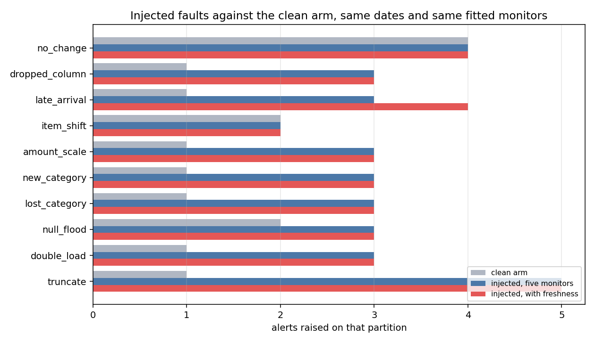

# pipeline-observability

Catch a broken data pipeline before the dashboard consumers do. This repo holds a small
orders pipeline and the run-metadata schema that watches it. Freshness and volume and
schema and distribution monitors are built on top of that metadata.

```
pip install -r requirements.txt
python -m pipeline.generate --start 2026-03-02 --end 2026-06-28 --out data/raw
python scripts/run_observed.py --start 2026-03-02 --end 2026-06-28
python -m tests.run_all
```

`pipeline.run` runs the same pipeline with nothing watching it. Keeping both is what makes
the cost of the collector measurable.

## Where the pieces sit

```
  data/raw/dt=YYYY-MM-DD/orders.jsonl        generated source events
        |
        |  pipeline.orders.load_raw          declared columns, partition overwrite
        v
  raw_orders  ----------------------------->  obs_dataset_metric   (done)
        |            obs.collect              obs_column_metric    (done)
        |  pipeline.orders.build_daily        obs_schema_version   (done)
        v            obs.tracker              obs_run              (done)
  daily_orders                                       |
                                                     v
                                       obs.history  ->  obs.baseline   (done)
                                                     |
                                                     v
                                    drift, alerts, freshness, timeline  (done)
```

The observability side is `obs/`. The thing being observed is `pipeline/`. They do not
import each other and that separation is the point. `scripts/run_observed.py` is the only
file that knows about both. The collector reaches into the pipeline's warehouse from the
outside, the same way it would have to if the pipeline were a dbt project or someone
else's job.

## The metadata schema

Four tables in `obs/schema.py`. The grain of each is the decision that matters, and each
one is enforced by a key rather than by a comment.

| table | grain | holds |
|---|---|---|
| `obs_run` | one row per pipeline, task, partition and attempt | timing, status, error, what triggered it |
| `obs_schema_version` | one row per distinct column list a dataset has had | the ordered columns and when the shape was first seen |
| `obs_dataset_metric` | one row per run and dataset | row count, byte size, event time range, schema hash |
| `obs_column_metric` | one row per run, dataset and column | nulls, distinct count, min, max, mean, quantiles, top values |

Three choices in there are worth arguing with.

**Schema is stored once per shape and referenced by hash.** The obvious alternative is a
snapshot row per run. That copies an unchanging column list thousands of times to answer a
question asked once per incident. Hashing makes "did the schema change between these two
runs" a string comparison. The hash is order sensitive on purpose. A column reorder breaks
a positional load and is a real incident, not noise.

**Column summaries are quantiles at fixed probabilities, not histograms.** Histogram bins
need edges chosen up front and edges chosen in week one are wrong by week five. Fixed
probabilities compare across any two days with no shared setup. The cost is that seven
quantiles cannot reconstruct a distribution, so a bimodal shift that leaves the quantiles
in place is invisible to this schema.

**`min_value` and `max_value` are text.** One table holds columns of every type, and
splitting into numeric, text and timestamp variants triples the width to serve a field a
human reads during an incident. The numeric summary a monitor reads is `mean_value` plus
`quantiles_json`. The cost is that you cannot write a SQL predicate over `min_value`
without a cast.

## The pipeline being watched

A two stage orders ELT. JSONL partitions land in `raw_orders`, then `daily_orders` is
built from them. Both stages overwrite their partition instead of appending, because a
retry is routine and an append-only load turns one retry into a doubled day. A doubled day
is also the exact shape a volume monitor is meant to catch, so an append here would let
the pipeline manufacture its own alerts.

Load columns are declared, not inferred. `read_json` will guess, and its guess changes
when the data changes, so a null-heavy day can silently retype a column. In a project
about detecting schema drift the loader has to be the one place that does not drift on its
own.

## The collector

`obs/tracker.py` records that a run happened. `obs/collect.py` profiles what it produced.
Four decisions in there are worth arguing with.

**The run row is written before the work, not after.** Timing a run and inserting when it
finishes records every run except the ones worth knowing about. A killed process never
reaches the insert, so the metadata says the run never happened, and a freshness check
then reads a run that died exactly like a pipeline nobody scheduled. Writing at the start
with status `running` costs a second write per run. What it buys is a row saying a run
began and never came back, which `tracker.stale_runs` can find.

**Collection is timed outside the run it belongs to.** Profiling inside the tracked block
would charge the run for the cost of watching it. Median recorded duration here is 10 ms
for `load_raw` and 7 ms for `build_daily` against roughly 38 ms to collect a dataset, so
the duration baseline would have been learning mostly the price of observability.

**Every column summary comes from one SELECT, and not for the reason I expected.** The
plan was that one scan would beat one query per column. It does not. On 254,952 rows the
single pass takes 79.4 ms and the eleven column loop takes 76.9 ms, because DuckDB is
columnar and a query reading one column never touched the other ten. The single pass stays
for two other reasons. It is one consistent snapshot rather than eleven, so a row count
and a null count cannot come from different states of a live table. And it is one round
trip instead of twelve, which is free locally and is the whole cost against a warehouse
across a network.

**Distinct counts are exact.** `approx_count_distinct` is 1.14x faster and its error is
nothing like a small wobble. See the table below. A monitor that cannot see a fourth
`status` value appear is not worth 1.14x.

**Quantiles are exact too, and that one was close.** They are the most expensive thing
the collector does, 31.4 ms of the 79.4, and `approx_quantile` was 2.57x faster at a
worst error of 0.27 percent when it was measured on the day-2 run. The reason it is
still not used is that a t-digest depends on the order rows arrive in. Reading the same
254,952 rows in a different physical order moved p05 by 0.35 percent with nothing about
the data changed. Day 4 is a drift check, and starting it with a noise floor that comes
from the estimator rather than the data is a bad trade for 19 ms on a job that runs once
a day. At a thousand times this volume the answer flips.

## Measured on this machine

**Correction, 2026-08-05. This file published a row count of 254,346 from day 1 to day 5 and
the real figure is 254,952.** It appeared four times here and twice in `obs/collect.py`. The
distinct `customer_id` count was wrong by a different amount, 84,649 published against 84,682
measured, so it was not one transcription slip propagating. `pipeline/generate.py` has a
single commit and has never been edited, the files on disk match it on every spot check, and
no 119 day window at the default seed and base produces 254,346. Where the number came from
is not known. Every figure derived from it has been re-measured rather than adjusted.

The reason it survived five days is worth more than the number. `data/` is gitignored,
because it is generated. So nothing published off it could be checked by anyone who cloned
this repo, including me on a later day. **Any figure below that comes from the generated data
now carries the command that rebuilds it.** That is the cheap half of the fix. The expensive
half, a checked in checksum of the generated corpus, is not done and is in the limitations.

```
python -m pipeline.generate --start 2026-01-01 --end 2026-04-29
python scripts/run_observed.py --start 2026-01-01 --end 2026-04-29
```

Run on 2026-08-05 into a scratch directory, that first command wrote 254,952 events across
119 partitions and all 119 files came back byte identical to the ones already on disk under
`cmp`. So the generator is deterministic at the default seed and the data it produces today
is the data these figures were taken from.

Sandbox is 2 cores and about 3.9 GB of RAM. Python 3.10, DuckDB 1.5.5. Everything in
this section was re-measured on the day-3 run, so the timings differ a little from the ones
an earlier version of this file carried. The only figures below not taken that day are the
two `approx_quantile` ones, which are marked where they appear.

**Re-measured on the day-5 run and the timings moved a lot.** The sandbox itself is slower
today, by about 1.8x across every stage. That is a fact about the machine and not about the
code, and it is the reason the block below is dated rather than headed "measured today".

**The day-4 claim about approximate distinct counts was wrong and this is the correction.**
That run reported the `loaded_at` error at 15.97 percent on day 3 and 6.72 percent on day 4
"on identical data" and concluded that a HyperLogLog sketch depends on the order rows reach
it. The data was not identical. `loaded_at` is written as the wall clock time of the load,
so its 119 values are different timestamps on every run and the sketch was being fed a
different column each time.

The conclusion stands and the evidence behind it has been replaced. The day-4 version rested
on two runs agreeing on a row count that no longer reproduces, so it is not something a
reader can check. The 08-05 test is stronger anyway. Build the same table two ways in one
session, once one partition at a time through the loader and once as a single glob read, and
compare. Those are genuinely different physical orders. All ten stable columns returned the
same approximate count under both. `loaded_at` was the only one that moved and it is the only
column that is not the same data twice. The estimator is stable and the measurement was not.

The order dependence result still holds for `approx_quantile`, where it was established on
08-01 by reading the same rows in a different physical order. It was never established for
`approx_count_distinct`, and the errors below are large enough on their own without it.

```
2026-08-05 run, one measurement each unless stated
generate   254,952 events across 119 partitions               5.1 s
pipeline   the same range with nothing watching it            4.4 s
observed   the same range with the collector wrapped round   13.2 s
collected  238 runs, 2 schema versions, 238 dataset metrics, 2261 column metrics
tests      11 modules, 378 cases, all passing
smoke      27,629 rows over 14 partitions, unchanged after a full rerun
           14 days build no weekday band and one pooled band of 1400 to 3094
alerts     17 alerts over 119 partitions, 14 incidents, none of them a page
incidents  10 clean and 10 injected partitions, 8 of 9 faults detected
```

The `observed` figure was 20.4 s and 21.7 s on earlier runs and is 13.2 s today. The cause
is not established. The machine itself has been measured moving by about 1.8x between days
on identical code, which covers most of a gap this size, and the filesystem finding above is
a second candidate. Both are plausible and neither was isolated, so this is recorded as an
unexplained move rather than attributed. Absolute timings in this file are only true on the
day they were taken.

Collection costs 9.1 s across 238 datasets, about 38 ms each. That is 3.6x the pipeline it
watches. The ratio is a property of how little each run does here rather than a fact about
collectors. A partition is around 2,100 rows, and profiling it is eleven aggregates over
that data plus a group by for each categorical column.

Profiling the full `raw_orders` table, median of three after a warm up query:

| approach | queries | day 3 | day 5 |
|---|---|---|---|
| single pass | 1 | 79.4 ms | 143.7 ms |
| one query per column, same aggregates | 12 | 76.9 ms | 140.3 ms |
| single pass, quantiles removed | 1 | 48.0 ms | 88.3 ms |
| single pass, approximate distinct counts | 1 | 69.8 ms | 135.6 ms |

Both columns are real measurements and the gap between them is the machine, not the code.
Every row moved by about 1.8x on the same query against the same table. What did not move
is the shape. Quantiles are 31.4 ms of the 79.4 on day 3 and 55.4 ms of the 143.7 on day 5,
so they are 40 percent and 39 percent of the single pass. The per column split stays within
a few percent of the single pass on both days. A ratio survives a slower machine and an
absolute timing does not, which is the argument for quoting the ratio.

`approx_count_distinct` against exact counts on the same table:

Re-measured 2026-08-05 against a `raw_orders` rebuilt by `scripts/run_observed.py`. The
earlier version of this table was derived from a row count that no longer reproduces, so
every figure in it was replaced rather than patched. See the correction note below.

| column | exact | approximate | error |
|---|---|---|---|
| `order_id` | 254,952 | 226,474 | 11.17% |
| `customer_id` | 84,682 | 64,837 | 23.43% |
| `ordered_at` | 250,455 | 257,408 | 2.78% |
| `order_amount_usd` | 18,078 | 16,134 | 10.75% |
| `loaded_at` | 119 | 102 | 14.29% |
| `dt` | 119 | 134 | 12.61% |
| `status` | 4 | 3 | 25.00% |
| `item_count` | 9 | 10 | 11.11% |
| `channel`, `country`, `coupon_code` | 4 to 6 | exact | 0% |

The error is not an order effect. The same table was built two ways on 2026-08-05, once by
`run_observed.py` inserting one partition at a time with a declared column list and once by
a single `read_json_auto` glob over all 119 files. Those are different physical row orders.
Every column above returned a byte identical approximate count under both. The one column
that moved was `loaded_at`, which stores the wall clock time of the load and is therefore
different data on every run rather than the same data read differently.

Those errors are far larger than the accuracy usually quoted for HyperLogLog. They are
reported as measured. I have not worked out why DuckDB's estimator is this far off on a
column with 119 values and I am not going to guess at a mechanism in a README.

Every row above except `loaded_at` reproduced exactly on the day-5 run. `loaded_at` is the
load timestamp, so it is a different column every run and it is the one row here that
should not be read as a repeated measurement.

The `status` row is the one that settled it. A column with four values reported as three
is not a tolerance a threshold can absorb, it is the appearance of a new category being
made invisible.

**The slowest run in the entire history is the first one.** Over 119 partitions `load_raw`
has a median of 10 ms and a maximum of 734 ms, and the 734 is the first partition. The
next slowest is 15 ms. Nothing about that date is unusual. The cost is opening the
database and loading the JSON reader, and it lands on whichever run happens to go first.
Any duration baseline built on day 3 has to deal with that or it will page someone every
time the process restarts.

Daily order volume over those 119 days, straight out of `daily_orders`:

| day | days observed | mean orders | sd |
|---|---|---|---|
| Monday | 17 | 2313 | 149 |
| Tuesday | 17 | 2229 | 187 |
| Wednesday | 17 | 2271 | 206 |
| Thursday | 17 | 2348 | 191 |
| Friday | 17 | 2526 | 164 |
| Saturday | 17 | 1691 | 134 |
| Sunday | 17 | 1582 | 126 |

Day of week accounts for 80.4 percent of the variance in daily volume, or 79.3 percent
adjusted for the six degrees of freedom the seven group means cost. Pooled standard
deviation is 367 orders and the residual after removing day of week is 163.

That gap is the argument for the seasonal baseline. A single static band has to be wide
enough to hold both a normal Sunday and a normal Friday. On this data that band spans 1094
to 3014 orders, a width of 1920. The per day-of-week band at the same three sigma is 977
wide. So a Friday has to lose 57 percent of its orders to break the static band and 19
percent to break the seasonal one.

**Read those numbers with the caveat below.** They are measured, and what they are
measured on is synthetic.

## The baseline

`obs/baseline.py` bands a series and `obs/history.py` pulls the observations out of the
metadata. Nothing in `baseline.py` imports duckdb. It takes lists of pairs, which is why
every case below can be tested without a database.

A band is a centre and a spread widened by k. It sits in raw or log space and uses either
mean with standard deviation or median with a scaled MAD. All four combinations come out
of the same `fit_bands` call. Building the losing side by hand is how a comparison gets
rigged, which happened in this repo two days ago, so there is one code path and the
configuration is an argument.

Run `python scripts/baseline_report.py --obs-db warehouse/obs.duckdb` to reproduce
everything below.


### The seasonal key is a property of the series, not of the project

The blueprint line for today read "seasonal baseline model for volume and duration". That
turned out to be two different answers. `choose_keying` measures it rather than assuming
it, by comparing the mean width of the seven keyed bands against one pooled band over the
same observations.

| series | keyed width | pooled width | ratio | variance explained | adjusted | flat keys | ships |
|---|---|---|---|---|---|---|---|
| volume, `raw_orders` | 868.2 | 2137.9 | 0.406 | 80.4% | 79.3% | 0 | keyed |
| duration, `load_raw` | 9.1 | 8.7 | 1.044 | 5.1% | 0.0% | 0 | pooled |
| duration, `build_daily` | 9.8 | 8.8 | 1.106 | 4.6% | -0.5% | 4 | pooled |

Volume is strongly weekly and the keyed bands are 59 percent narrower. Duration is not
weekly at all. Splitting it seven ways produces bands that are *wider* than the pooled one,
because 17 observations per group estimate a spread worse than 119 do and there is no real
between group difference to recover. The adjusted figure for `build_daily` is negative,
which is what it looks like when seven group means explain less than the degrees of
freedom they cost.

There is a floor under this that matters more than the statistics. `duration_ms` is an
integer. `load_raw` has a median of 11 ms, so one unit of resolution is 9.1 percent of a
typical value. The seven weekday medians are `10 11 11 11 11 11 12`. The largest gap
between any two of them is two units. A weekly effect that small is not a small effect,
it is an effect nothing here could have seen. The honest claim is not that duration has
no weekly pattern. It is that none is detectable at this resolution, and a monitor
should not model what it cannot measure.

So volume ships keyed by weekday and duration ships pooled.

### Four of seven `build_daily` bands had no width at all

`build_daily` runs in 6 to 12 ms and most runs land on the same integer. On four weekdays
more than half the observations were the same value, the MAD came out as exactly 0, and
the band collapsed to a point. A band of zero width is not a conservative band. It is a
monitor that fires on everything.

Those bands are marked `degenerate` and `check` returns `unbanded` rather than `high`. A
key with no band returns `unknown_key`. Both are separate answers from `ok`, because
collapsing "I cannot judge this" into "this is fine" is how a dashboard ends up green over
nothing.

The MAD collapses this way whenever more than half the values sit on one number. That is
the cost of a 50 percent breakdown point and it is not a bug. It is the reason
`choose_keying` treats any collapsed key as a reason to pool.

### The median is the default, and the reason is a number

One day doubled inside the training history, which is what a duplicated load looks like:

| space | estimator | clean high edge | contaminated high edge | moved |
|---|---|---|---|---|
| log | median + MAD | 2911.6 | 3037.5 | 4.3% |
| log | mean + sd | 2809.3 | 4076.9 | 45.1% |
| raw | median + MAD | 2856.7 | 2979.1 | 4.3% |
| raw | mean + sd | 2760.8 | 4120.9 | 49.3% |

The point is not that the doubled day should be caught. All four catch it. The point is
what happens to the *next* one. A mean band that widened by 45 percent absorbing the first
duplicate has moved its edge to 4077 orders, and a second duplicated Monday at 4534 is now
much closer to normal than it was. The median band did not move.

The same effect shows up in the duration bands without any help. Fitted over all 119
`load_raw` runs including the cold start, the mean band is 202.6 ms wide in raw space and
64.5 ms in log space. The median band is 8.9 ms. One observation out of 119 is doing all of
that.

And the mean band fires on 0 of 119 training observations for volume. A monitor that never
fires on its own history is not a safe monitor, it is an uninformative one.

### The first run of the process, and why it cannot be absorbed

`load_raw` over 119 partitions has a median of 11 ms. The first run takes 921 ms. Fitting a
warm band on the other 118 gives 7.5 to 16.2 ms, and the first run sits 34.3 spreads above
the centre.

Widening the band to hold it needs k of 34.3, which puts the high edge at 921 ms, or 84x
the median. Buying silence on the restart costs every regression smaller than 84x. That is
not a trade worth making, so the shipped band stays at three sigma and the first run of a
process fires.

Firing is the correct behaviour and it is still an alert nobody wants every morning. The
fix is not in the baseline. It is a label saying this run was cold, which the collector
does not write today, and suppression on it belongs next to the rest of the alert routing
on day 5.

**`build_daily` does not have this problem and that is the part worth noticing.** Its first
run is 6 ms, which is the fastest of all 119 and sits 0.8 spreads *below* the centre. So
the cold start is not a property of the first run of a process. It is a property of the
first run of a task that has to load something, and `load_raw` opens the database and the
JSON reader while `build_daily` is SQL over structures that are already warm. A rule that
excluded every first observation would have thrown away a perfectly good one here.

`build_daily` has a different outlier instead. Its slowest run is 122 ms at ordinal 105 out
of 119, against a next slowest of 26 ms and a median of 7 ms, and nothing distinguishes
that date. It is the machine, not the data.

### A third of the band is trend, not noise

The generator has 0.15 percent daily growth in it, which compounds to about 19 percent over
119 days, and the observed series moves 14.2 percent from its first 28 partitions to its
last 28. A band fitted over the whole history holds all of that as if it were spread.

Each row below fits on a trailing window and then judges the same most recent 28
partitions, so the last column is comparable across rows in a way a fire rate on each
window's own training data is not.

| window | per weekday | bands | mean width | fires on own history | fires on last 28 |
|---|---|---|---|---|---|
| all 119 | 17 | 7 | 868.2 | 0.025 | 0.036 |
| 84 | 12 | 7 | 594.9 | 0.083 | 0.107 |
| 56 | 8 | 7 | 564.2 | 0.143 | 0.179 |
| 42 | 6 | 0 | too few observations per key | | |
| 28 | 4 | 0 | too few observations per key | | |

The full history band is 35 percent wider than a 56 day one, and the difference is drift
rather than variability. But the shorter window fires on 18 percent of recent partitions
against 3.6 percent, because eight observations per weekday estimate a spread badly. A
weekday key charges seven observations for every one it uses, and at 42 days there is not
enough left to build a band at all.

The full window ships, because it is the conservative end and because choosing a shorter
one by which fire rate reads best is the same mistake as tuning a threshold to the data it
will be judged on. The real answer is a trend term, which would let a short window keep its
observations, and that is not a thing to bolt on at the end of a day. It goes next to day
4, where the same question turns up again for column distributions.

### Seventeen observations per weekday is not many

Refitting each weekday band with one observation held out, seventeen times:

| key | low edge range | high edge range |
|---|---|---|
| Monday | 1797 to 1935 | 2861 to 2952 |
| Tuesday | 1844 to 1965 | 2534 to 2625 |
| Wednesday | 1644 to 1713 | 2895 to 3022 |
| Thursday | 1889 to 2069 | 2697 to 2955 |
| Friday | 2137 to 2245 | 2944 to 3036 |
| Saturday | 1305 to 1460 | 2146 to 2297 |
| Sunday | 1200 to 1247 | 2003 to 2058 |

Thursday's low edge moves 180 orders depending on which single day is dropped. That is not
a confidence interval and it is not presented as one. It is the honest version of the
question, which is how much of this band is the data and how much is which seventeen days
happened to be in it.

### What ships

Volume keyed by weekday. Log space, median and MAD, three sigma:

| key | n | low | centre | high | width |
|---|---|---|---|---|---|
| Monday | 17 | 1853 | 2323 | 2912 | 1058 |
| Tuesday | 17 | 1895 | 2211 | 2580 | 685 |
| Wednesday | 17 | 1673 | 2228 | 2967 | 1294 |
| Thursday | 17 | 2034 | 2362 | 2743 | 708 |
| Friday | 17 | 2180 | 2559 | 3004 | 825 |
| Saturday | 17 | 1458 | 1768 | 2144 | 686 |
| Sunday | 17 | 1221 | 1579 | 2042 | 821 |

It fires on 3 of its own 119 training observations, a rate of 0.025. Pooled duration bands
are 7.5 to 16.2 ms for `load_raw` firing on 6 of 119, and 3.9 to 12.7 ms for `build_daily`
firing on 2 of 119. Those rates are measured on the training data, so they are a floor on
the false alarm rate rather than an estimate of the real one.

## Distribution drift

`obs/drift.py` and `obs/history.column_history` and `scripts/drift_report.py`. The last of
those measures every claim in this section. Run it with:

```
python scripts/drift_report.py --obs-db /tmp/obs.duckdb --db /tmp/orders.duckdb \
    --chart docs/drift.png
```

The blueprint line says "distribution drift checks on key columns". Three things a stored
column profile offers look like drift signals. Measured on the 119 partition history, two
of them are not.

### distinct_count is the volume monitor with a different name

Correlation between a column's distinct count and the partition's row count, over the same
119 partitions:

| column | distinct count against rows | verdict |
|---|---|---|
| customer_id | +0.9999 | refused |
| order_amount_usd | +0.9985 | refused |
| item_count | +0.1626 | kept |
| status, channel, coupon_code | no spread, constant | held as a constant |

A weekday baseline fitted on `customer_id` distinct counts lands on a width ratio of 0.404
with 80.5 percent of variance explained. The volume baseline from day 3 lands on 0.406 and
80.4 percent. It is the same signal to three decimal places. Band it and you have a monitor
that fires when traffic moves and reports it as a cardinality problem.

Dividing by the row count is not the fix. `distinct_ratio` is refused on five of the six
watched columns, most of them at about minus 0.99, because a column with a fixed vocabulary
has a constant numerator and a growing denominator. On `customer_id` the ratio survives the
coupling check at minus 0.6956 and then still comes out **weekday keyed** at a ratio of
0.723, because the expected number of distinct values in a sample is not linear in the
sample size. Normalising reduces the volume signature and does not remove it.

`volume_coupling` and `usable_signals` make this a measurement in shipped code. The
refusals and their measured coupling are carried on the monitor, so it can report what it
declined to watch.

### seven quantiles cannot answer the question, and the size of the hole is exactly 0.25

The natural statistic for "has this distribution moved" is the Kolmogorov Smirnov distance.
It cannot be computed from what day 1 chose to store. Seven quantiles pin the inverse
cumulative function at seven places and say nothing about the shape between them, so the
distance can only be bounded from below. `ks_bound` does that.

The gaps between the stored probabilities run `0.01 0.04 0.20 0.25 0.25 0.20 0.04 0.01`.
Inside one gap both cumulative functions start and end at the same two points and are
free in between, so they can separate by the whole gap while every stored quantile agrees.
The blind spot is the largest gap, which is **0.25**.

That is an argument until something reaches it. `drift.worst_case_pair` builds two samples
whose stored vectors agree to 0.00e+00 and whose true KS distance is 0.2499, and
`tests/test_drift.py` asserts it. A quarter of the mass can move without moving a single
number this schema keeps.

The bound is honest and on this feed it is silent:

| pair | true KS from the rows | bound from the seven quantiles |
|---|---|---|
| 03-02 against 03-03 | 0.0354 | 0.0000 |
| 03-02 against 03-04 | 0.0238 | 0.0000 |
| 03-02 against 03-08 | 0.0388 | 0.0000 |

Zero of 118 consecutive partition pairs bound above zero, on both numeric columns. So the
bound is not the detector. It ships as a constant zero signal, which means it fires exactly
when drift is provable and never on a judgement call. What detects is `quantile_shift`, the
per probability movement of the stored values scaled by the reference interquartile range.
It answers a narrower question than the one anyone wants, and it is the question the data
can support.

### the trend problem from day 3 does not transfer, and a smaller one does

`ot-017` says 35 percent of the volume band's width is trend rather than variability. The
same question here gets a different answer. Across the window the row count moves 15.88
percent and these signals do not follow it.

| signal | first 28 | last 28 | change |
|---|---|---|---|
| order_amount_usd quantile_shift | 0.22382 | 0.21312 | -4.78% |
| coupon_code null_rate | 0.77956 | 0.77917 | -0.05% |
| customer_id distinct_ratio | 0.98990 | 0.98852 | -0.14% |
| row_count | 2065.5 | 2393.5 | +15.88% |

The level does not trend. The noise does, and that is the second order version of the same
problem. A distance from a fixed reference is sampling error when nothing is wrong, and
sampling error falls as one over the square root of the partition size. Bucketed by row
count rather than by date, so nothing but size varies:

| signal | small n | large n | observed ratio | predicted |
|---|---|---|---|---|
| order_amount_usd quantile_shift | 0.2072 | 0.1644 | 0.794 | 0.813 |
| coupon_code share_tv | 0.0142 | 0.0101 | 0.710 | 0.813 |
| status share_tv | 0.0098 | 0.0085 | 0.866 | 0.813 |
| channel share_tv | 0.0142 | 0.0125 | 0.881 | 0.813 |

Four signals, all near the predicted ratio. So a band fitted over a window where traffic
grew is slightly too wide at the end of it, for a reason that has nothing to do with the
distributions. The effect is a few percent here against 35 percent for volume, which is why
it is recorded rather than fixed.

### a signal that has never moved is held as a constant, not as a band

Day 3 made a band with zero spread refuse to judge, which is right for a duration. It is
wrong here. `status` has held four distinct values for all 119 partitions and a fifth
appearing is the incident a categorical monitor exists to catch. `order_amount_usd` has
never had a null. Under a robust band both are degenerate and stay silent forever.

So a flat signal is held as a constant and any change fires. It is a different status word,
`changed`, for the same reason `unbanded` and `unknown_key` are different words. On this
history that covers 11 of the 25 watched signals.

### fire rates, on training data

| column | signal | kind | fired | rate |
|---|---|---|---|---|
| order_amount_usd | quantile_shift | pooled | 7 | 0.059 |
| coupon_code | share_tv | pooled | 4 | 0.034 |
| status | share_tv | pooled | 4 | 0.034 |
| channel | share_tv | pooled | 1 | 0.008 |
| customer_id | distinct_ratio | keyed | 1 | 0.008 |
| item_count | quantile_shift | pooled | 0 | 0.000 |

`item_count` is worth its own line. It is an integer between 1 and 9, so its seven stored
quantiles are the same seven integers on all 119 partitions and `quantile_shift` is exactly
zero throughout. That is the day-3 resolution floor arriving in a different place. The
column has a distribution and this schema cannot see it move.

Every rate here is measured on the partitions the reference and the bands were fitted on,
so they are floors on the false alarm rate rather than estimates of it. That holds until
day 6.

## Alerting

`obs/alerting.py` plus `obs/history.coverage` and `obs/history.cold_start_history`. The
report at `scripts/alert_report.py` measures every claim in this section. Run it with:

```
python scripts/alert_report.py --obs-db /tmp/obs.duckdb --chart docs/alerts.png
```

A monitor answers "is this partition unusual". An alert answers "should somebody stop what
they are doing". Days 3 and 4 built the first thing. This is the second, and the gap
between them turned out to be wider than the blueprint line suggested.

Measured today on the same 119 partition history. Every figure below reruns.

### routing to a severity is the easy half, and it is the half that does nothing

The policy table is small and the asymmetries in it are the whole content. Volume falling
is missing data and volume rising is usually a replay, so they are different events.
A vocabulary losing a value means something upstream stopped producing it, which is worse
than gaining one. That part was straightforward.

Then the gate meant to keep noisy signals off the pager was measured and it refuses
**nothing**. Zero of eighteen watched signals. The ten that can page are all quiet enough
and the eight that cannot are all held back by policy rather than by the gate. It is kept,
because the policy it guards is a table anyone can edit, and the report prints that it is
idle so the next reader is not misled about what is protecting them.

### the fire rate that approved those ten pages was a tautology

Worse than idle. A signal whose history never moved is stored as a constant, and a constant
cannot fire on the partitions that defined it. Its in sample fire rate is 0.000 because of
how it was built, not because of anything anyone measured. Every one of the ten signals
allowed to page was a constant.

So the rate is now fitted on the first 70 percent of the history and counted on the rest.
The two disagree on six of eighteen signals:

| column | signal | in sample | out of sample |
|---|---|---|---|
| coupon_code | null_rate | 0.000 | 0.028 |
| customer_id | distinct_ratio | 0.008 | 0.111 |
| order_amount_usd | quantile_shift | 0.059 | 0.083 |
| status | share_tv | 0.034 | 0.028 |
| channel | share_tv | 0.008 | 0.000 |
| coupon_code | share_tv | 0.034 | 0.000 |

`coupon_code null_rate` is the case that matters. In sample it is a constant with a fire
rate of zero and it is allowed to page. Out of sample it moves. The number that approved it
was describing the fitting procedure and not the signal.

### 238 of 255 alerts were the monitor talking about itself

The first version routed an `unbanded` or `unknown_key` verdict to an `info` alert. Two
signals on `item_count` cannot be banded. That produced two alerts on every partition and it
would have done so forever. Each one said the same thing about the monitor rather than
anything about the day. 238 of 255 alerts, 93 percent.

Whether a band could be fitted is a fact about the monitor and not about the partition it
was pointed at. It gets said once, at fit time, by `coverage_gaps`. After the fix the
history produces **17 alerts** rather than 255, and the two gaps are reported once.

### the cold start label exists now, and it does not justify a suppression rule

Day 2 measured `load_raw`'s first run at 921 ms against a median of 11, and day 3 worked
out that holding it inside a band needs k of 34.3. The label asked for is now written by
the tracker into `obs_run.cold_start`, because a process boundary does not survive into the
stored rows and cannot be recovered later from a gap in `started_at`.

Suppressing on it is a different question and the answer is no. Measured today:

| | |
|---|---|
| runs in the history | 119 |
| marked cold | 1 |
| cold share | 0.0084 |
| cold median against warm median | 1711 ms against 17 ms, 100.6x |

One in 119 because this history is a backfill inside one process. A daily schedule runs
every partition in its own process, so every run there is cold and the same rule silences
the monitor completely. The rule cannot be validated on data collected this way.

Banding on the flag instead of suppressing on it fails too, and it fails honestly. One cold
observation is below the seven a band needs, so `check(cold=True)` returns `unknown_key`.
The monitor says it knows nothing about a cold run, which is true and useless.

This is a sampling problem wearing a suppression problem's clothes. A backfill's duration
distribution cannot train a monitor for a scheduled pipeline.

### two bands, which is what ot-017 turned into

The volume band fitted over the whole history is 868.2 wide. Over the last 56 partitions it
is 564.2. A third of the wide band is the feed's own growth held as if it were spread.

Day 4 moved the choice here on the grounds that alerting is the first consumer that pays
for a band being wider than it needs to be. Having got here, the choice is a false one.
Both bands measured over the same last 56 partitions:

| band | fitted on | mean width | fire rate |
|---|---|---|---|
| wide | 119 partitions | 868.2 | 0.018 |
| narrow | 56 partitions | 564.2 | 0.143 |

| where the last 56 land | count |
|---|---|
| inside both | 47 |
| between the two | 8 |
| outside both | 1 |

A value outside the wide band is unambiguous and it pages. A value in the middle is unusual
against recent traffic and ordinary against the year. That is a real state, it is not an
emergency, and it gets a ticket. The trend that made the wide band too wide is exactly what
makes it the right line for the louder of the two.

### the three silences, and only two of them are checkable

`collect_into` swallows every exception, so a broken collector leaves a successful run with
no metric row. By day 4 that was three separate readers for which the same silence was
invisible. `history.coverage` checks it, and the three cases are not equally answerable.

A successful run with no dataset metric is visible, because the run row is there and the
metric row is not. A dataset metric with no column metrics is the same thing one level
down. A partition nothing ever ran for is **not** visible, because a table holding one row
per run has no opinion about runs that did not happen. It needs a list of partitions that
should exist and that list has to come from outside, which is why `expected_partitions` is
an argument and not a query. Passing nothing does not make the check pass, it makes it
absent, and the returned flag says which of those happened.

The first version of that check reported 119 false positives on its first real run, because
it asked every `build_daily` run for a `raw_orders` metric it was never going to write. It
now reads the producing tasks back out of the metadata. That scoping has its own hole. A
task is only known to produce a dataset because it once did, so a collector that broke is
caught and a collector that never worked is not.

### suppression caps, it does not delete

A window that deletes alerts means the one real incident during a deploy is gone with no
record. A window that caps severity still writes everything down and only stops the phone
ringing. Over a two week window on this history, 2 tickets were capped to info and nothing
was removed.

Overlapping windows take the quietest ceiling and record every reason. The first version
took whichever window came first and stopped, and a mutant that deleted the stop survived,
because the fixture had only ever held one window.

### what ships, and what is not yet tested

17 alerts across 119 partitions, collapsing into 14 incidents. **Zero of them page.** That
is the honest state. This feed has no injected failures in it, so the severity routing, the
grouping and the windows have all been exercised against ordinary data and none of them
against a real incident. Grouping saves three messages here, which is not a case for it.
Day 6 is when that gets tested.

## Injected failures, and the control arm that mattered more

Days 3 to 5 built six monitors and measured every one of them against a feed that never
breaks. `pipeline/inject.py` holds ten faults. Each one declares, before the run, which
monitor should answer for it. `scripts/incident_report.py` runs two arms over the same ten
future dates, one clean and one injected, judged by monitors fitted once on the clean 119
and never refitted. Out of sample by construction rather than by promise.

Writing the expectation down first is the only thing that makes a miss visible. A harness
that reports whatever fired and calls it detection can never fail.

```
python scripts/incident_report.py --obs-db /tmp/obs.duckdb --db /tmp/wh.duckdb
```

### the control arm is the finding, not the detection column

Ten clean partitions the fit had never seen. All ten alerted.

| monitor | subject | fired on clean |
|---|---|---|
| duration | `duration_ms` | 10 of 10 |
| volume | `row_count` | 3 of 10 |
| drift | `customer_id distinct_ratio` | 1 of 10 |
| drift | `coupon_code null_rate` | 1 of 10 |

A subject that fires on ten of ten clean partitions is saying nothing when it fires on a
broken one. So detection has to be read as a set difference against this arm and not as a
count of what went off. Every headline number below is that difference.



The bottom row of that chart is the argument. `no_change` injects nothing at all and still
raises four alerts. Read the grey bar first on every row.

**8 of 9 faults fired a subject the clean arm did not. Only 6 of 9 were caught by the
monitor named beforehand.** The tenth scenario is a no-op control and is excluded from
both.

### the duration baseline learned the speed of a filesystem

The 10 of 10 has a cause and it is not the monitor. Training partitions were read off the
mounted Projects folder. The arm partitions were written to `/tmp`. Same loader, same code,
same row counts.

Thirty partitions were copied from the mount to `/tmp` and checked byte identical with
`filecmp`. Then loaded from both locations, twice each. The cold first run of each pass is
dropped. That leaves 58 observations per location, measured on 2026-08-05:

```
mount  data/raw   median 13.66 ms   min 9.58  max 20.07
tmp    /tmp       median  4.03 ms   min 3.00  max  6.22
```

A 3.4x gap on identical bytes. A duration band is therefore not a property of the pipeline.
It is a property of the pipeline plus the storage its input happened to sit on, and moving
the input pages on everything forever. Table growth was ruled out separately, correlation of
duration with partition order is +0.0158 once the cold first run is excluded.

An earlier measurement of this put the gap at 1.7x by comparing training partitions against
arm partitions. Those are different files with different row counts, so it was measuring the
filesystem and the data at once. The copied byte identical version above is the better test
and it moved the number a lot. The mount side reproduced closely, 13.4 ms then against 13.66
now. The `/tmp` side did not, 7.8 ms then against 4.03 now. The ratio is unstable and the
sign of it is not.

This is `ot-023` and it is not fixed. Three ways out and all of them cost something. Refit
per environment and say so. Normalise to something storage independent such as milliseconds
per thousand rows. Or drop duration from the pager. Day 7 decides.

### the tracker was timing its own metadata write

`started = clock()` ran before `next_attempt` and `store.insert_run`, so every duration this
project has recorded included the cost of writing the row that records it. Measured at 2.8 ms
against a recorded median of 30, which is 9 percent.

Day 2 moved the profiling queries out of the tracked block for exactly this reason and left
the run row insert inside it. The fix is a second clock read. **Durations recorded before
this change and after it are not comparable.**

### day 5's holdout leaked its own reference

`holdout_fire_rates` took bands from the first 70 percent of the history and signal values
from `signal_series(obs)` over all of it. That function derives its reference from whatever
list it is handed, so the reference had already seen the held out partitions. Half the split
was held out.

Fixing it needed `Monitor.signals` to exist first, which is the function that scores a
partition the fit never saw. **No fitted monitor in this repo could score a new partition
until day 6.** Every fire rate published before then was in sample on at least one side.

### what the faults found

`late_arrival` had no owner. Nothing in the stack read event time, so `obs/freshness.py` was
written mid run rather than planned. `event_time_min` and `event_time_max` have been
collected on every run since day 2 and nothing had ever read them. It detects the late
partition at page severity. That is the answerable half of `ot-015`. The restatement window
is still open.

`dropped_column` was missed by the monitor named for it. The loader declares its column
list, so a column that disappears upstream arrives as a column full of nulls and the schema
hash never moves. Both hashes came back identical across the clean and dropped arms, and
`channel` was null on 2,858 of 2,858 rows. The null rate monitor caught it. A schema monitor
sitting behind a declared column list cannot see an upstream drop, which is an argument for
profiling the source and not only the landed table.

`item_shift` was missed by everything. Adding a whole integer to half the rows of a 1 to 9
column produced no new subject. That is the largest move that column can make and it is
invisible at this resolution, which answers `ot-019` negatively. The fix is a share vector
for low cardinality integers rather than seven stored quantiles. Not built.

### the timeline

`obs/timeline.py` assembles one partition into four things. The runs that touched it and the
alerts it raised. The schema in force at the time. The last known good partition before it.
It imports no duckdb and takes rows from `obs/history.py`, so it is a view rather than a
second query layer.

Upstream is declared rather than derived. The day-1 schema has four tables and none of them
holds an edge between tasks, so anything claiming to derive a dependency graph here would be
inferring it from names. Declared and honest beats derived and wrong.

## Known limitations

**The source data is generated, and its weekly shape is assumed rather than observed.**
The day of week factors in `pipeline/generate.py` are a plausible retail pattern that I
chose. So the 80.4 percent figure above is a true statement about this feed and not
evidence about real traffic. Anyone reading it as the latter is reading it wrong.

**That creates a circularity risk for the volume baseline and it is not solved.** If the
generator lays down a clean weekly pattern and the baseline learns that pattern, nothing
has been shown. The 80.4 percent and the 0.406 width ratio are both true statements about
this feed and neither is evidence that the design works. Two things push back. The
generator is multiplicative and the raw space band is additive, so those two configurations
are not the same model and the report runs both. More importantly the test of this baseline
is not fit quality. It is whether it stays quiet through the nuisances that go in on day 6
as injected failures.

That test has now run and the volume baseline half passed it. It fired on 3 of 10 clean
partitions, which is not quiet. The duration baseline failed it outright at 10 of 10 for a
reason that turned out to be the filesystem rather than the model. Both are above.

**The findings about the estimators do not depend on the generated data, and the findings
about the seasonal key do.** That one day doubled in the history moves a mean band 45
percent and a median band 4.3 percent is arithmetic. That volume is weekly and duration is
not is a fact about a feed I wrote.

**Figures taken from the generated data rest on an artefact nobody else has.** `data/` is
gitignored because it is generated. That is how a wrong row count survived five days in this
file. The rebuild command is printed above and it is verified deterministic, which lets a
reader check any number here. What is still missing is a checked in checksum of the corpus,
so nothing detects the corpus changing except a person re-reading the figures.

**The metadata schema is create only and has no migration path.** `schema.apply` runs
`CREATE TABLE IF NOT EXISTS`, so adding a column to `obs_run` leaves an existing database on
the old shape and every insert then fails on the column count. Nothing has noticed because
every run here rebuilds from scratch under `/tmp`. Acceptable for a portfolio project and
not acceptable anywhere else. Tracked as `ot-021`.

**`incident_report.py` writes its arm copies to fixed scratch paths.** A `--scratch` flag
exists now because a previous run left files behind under a different owner and the next run
died on `shutil.copy`. The flag is a workaround. It still does not clean up after itself.

**Every monitor here is fitted once and never refitted.** A real baseline moves as the data
moves, and this one does not. Nothing in the project claims otherwise and nothing implements
it either. It matters more than it looks, because a band fitted on 119 days and never
updated will drift out of usefulness on its own.

**Faults are injected one per partition.** Real incidents arrive together and interact. A
harness that only ever tests one at a time cannot say anything about how the monitors behave
when two things break at once.

**The band has no trend term, so it is fitted on a series that is drifting.** Measured
above at 35 percent of the width on this data. The two ways out both cost something and
neither was taken today.

**Log space is the default and on this data it is not doing much.** The argument for it is
that the generator is multiplicative, so an additive band on raw counts is the wrong shape.
The measurement says the volume bands come out 868.2 wide in log space and 869.2 in raw, a
difference of 0.1 percent, because the spread here is small relative to the level and over
a small range the two are nearly the same. So the default is defended by the form of the
data and not by the numbers. It would start to matter on a series with a much larger
relative spread, and it already matters for duration, where the mean and standard deviation
band is 202.6 ms wide in raw space and 64.5 ms in log.

**k is 3 and it is not tuned.** It is the conventional starting point. The report measures
what it costs at 3, which is a fire rate of 0.025 on the training history for volume, and
nothing has calibrated it against a real cost of a false alarm because there is no real
consumer yet.

**Every fire rate quoted here is measured on the training data.** A band evaluated against
the observations it was fitted on is at its most flattering, so those rates are a floor and
not an estimate. There is no held out period and there will not be a meaningful one until
day 6 puts known failures in.

**A quarter of a distribution can move without this schema noticing.** Measured above and
demonstrated with a constructed pair. Storing more probabilities shrinks the blind spot and
never closes it, and the honest fix is a sketch that supports a real distance rather than
more fixed points. That is a day-1 schema decision and reopening it would throw away the
history. It stays, named.

**The reference for every drift signal is fitted on the whole history and then measured
against it.** Same shape as the day-3 fire rates and the same answer. These are floors.

**Nothing here watches a column that is not in `WATCHED`.** The list is six columns picked
by hand in `scripts/drift_report.py`. Generating suites from observed profiles is day 6.

**A cold start cannot be labelled from the metadata as it stands.** The 921 ms first run is
correctly flagged and there is no column that says why. Suppressing it needs the collector
to record that the process was cold, and inferring it from a gap in `started_at` would not
survive contact with a real daily schedule, where every run is 24 hours after the last one
and every run is cold. The label belongs in the collector and the suppression belongs in
day 5.

**A log space band cannot hold a zero.** A task fast enough to record 0 ms raises instead
of being clamped, because a floor invented to keep the fit alive is a number nobody chose
appearing in an alert threshold. `build_daily` is already at 6 ms. If it gets faster, the
answer is to record microseconds.

**The MAD collapses when more than half the values are the same.** This is the flip side of
its 50 percent breakdown point rather than a defect, and on integer millisecond durations it
happens often. Four of seven `build_daily` weekday bands came out with zero width. They are
marked and refuse to judge, which is safe, and it does mean a robust estimator on
low resolution data can produce no baseline at all rather than a bad one.

**`daily_orders` groups on the partition date, not on `ordered_at`.** An event that
happened on the 3rd and landed in the 4th's file is counted on the 4th. The generator
never does that, so the pipeline is correct here only because its source is well behaved.
That is the single most likely place a real feed would break this, and late arrival is on
the day-6 list of injected failures.

**A collector failure leaves a gap, and a gap is ambiguous.** `collect_into` catches
everything, because the pipeline should not fall over when the thing watching it does.
What is left behind is a successful run with no dataset metric row. Day 5 can alert on
that. What it cannot do is tell a broken collector apart from a dataset nobody pointed the
collector at, and both look like silence.

**`next_attempt` scans `obs_run` on every run start.** There is no index, so the cost
grows with the history rather than staying flat. At 238 rows it is invisible. At ten
million it is a full scan every time a task starts, which is the kind of thing that looks
free for a year and then does not.

**Attempt numbers are read then written, which is not atomic.** Under DuckDB in one
process this is fine, and the unique key would reject a real collision anyway. Under
Snowflake it is not fine, because Snowflake accepts a unique constraint and enforces
nothing, so two schedulers starting the same partition would both write the same attempt
number and neither would be told.

**Top values are only collected below 50 distinct values, and that cutoff is a guess.**
The categorical columns here sit at 4 to 6 values, so 50 is far enough above them to be
safe rather than tuned. A real feed with a 200 value category would get no top values at
all and nothing would say so.

**A quantile summary cannot see a shift that preserves the quantiles.** This is the day-1
schema tradeoff arriving in the collector. Seven probabilities do not reconstruct a
distribution, so a bimodal split that leaves the deciles where they were is invisible.
Day 4 has to say plainly what its drift check can and cannot detect.

**The Snowflake DDL has never been run.** It is generated from the same template as the
DuckDB DDL so the two cannot drift apart, and it is unverified. It also carries a real
behaviour difference. Snowflake accepts `PRIMARY KEY` and `FOREIGN KEY` and enforces
neither, so the grain guarantees that hold here are documentation there. The collector has
to treat a duplicate grain as its own problem rather than expect the warehouse to reject
it.

**No Airflow yet.** The blueprint lists it and `pipeline/run.py` is a plain loop today.
The DAG comes when there is more than one task worth scheduling.

## Tests

`python -m tests.run_all` is the only entrypoint and CI calls nothing else. A module that
reports zero cases fails the run, because the usual way a suite lies is not a wrong
assertion. It is a file the runner imported and never executed.

`scripts/smoke.py` covers the command line path. It generates two weeks and runs the range.
Then it snapshots the counts, runs the same range again and compares. Then it runs the
observed path and holds the metadata to the warehouse. The row counts in `obs_dataset_metric` have
to add up to the rows actually in `raw_orders`. Every collector unit test points it at a
table built inside the test, so this is the only place its numbers meet a pipeline that
really ran.

Every check here was falsified before it was kept. Reverting the fix and confirming the
test goes red is the only way to know a test tests anything.

| mutation | result |
|---|---|
| `load_raw` appends instead of overwriting the partition | 8/11, doubles to 4076 rows |
| `schema_hash` joins name and type pairs with a newline | 14/15, two schemas collide |
| drop the composite key on `obs_column_metric` | 14/15, duplicate grain accepted |
| a test module that asserts nothing | run_all fails it at 0 cases |
| the same appending load, against the smoke check | exit 1, 27,629 rows become 55,258 |
| drop the transaction around the delete and the insert | 11/12, a bad file empties the partition |
| the profile query drops its `WHERE` clause | crashes on a parameter mismatch |
| the result row is sliced one position out | crashes converting a date to a float |
| `null_count` reports the non nulls instead | 31/32 |
| identifiers are not quoted | crashes on a column named `select` |
| `collect_into` raises instead of recording a gap | the failure escapes to the caller |
| `ks_bound` assumes F(x) equals p at its own quantile | 52/53, two identical tied vectors bound apart by 0.49 |
| `ks_bound` reads only the reference vector | 52/53, a provable separation reports as zero |
| `blind_spot` takes the smallest gap | 52/53, the constructed pair no longer reaches it |
| `usable_signals` only checks positive correlation | 52/53, every inverse signal gets through |
| a constant signal is banded instead of held constant | 52/53, a fifth status category passes |
| `column_history` keeps the first attempt | 52/53, a failed retry becomes the observation |
| `column_history` drops the success filter | 52/53, a failed run's profile enters the history |
| `raises_message` stops comparing the message | 52/53, caught by its own probe |
| top values ignore the partition filter | 30/32 |
| the run row is written after the work instead of before | the running row is not there to find |
| the tracker swallows the failure | 15/18 |
| `next_attempt` always returns 1 | the retry overwrites the first attempt |
| `stale_runs` ignores its cutoff | 17/18 |
| the collector profiles the table instead of the partition | smoke: 211,675 recorded against 27,629 loaded |
| the run is never closed out | smoke: 0 successful runs for 14 days of two tasks |
| `median_mad` returns the mean and standard deviation | 53/58 |
| a zero spread band is not marked degenerate | crashes dividing by zero |
| an unknown key is answered `ok` | 57/58 |
| log space clamps a zero instead of raising | 56/58 |
| the last successful attempt becomes the first | 54/58 |
| the defensive sort goes and the rows arrive in reverse attempt order | 54/58 |
| the duration history keeps failed runs | 57/58 |
| an unreadable partition key is dropped without being counted | 56/58 |
| the adjusted variance does not charge for the groups | 57/58 |
| `choose_keying` ignores a key whose spread collapsed | 56/58 |
| `fit_bands` ignores its minimum observation count | 57/58 |
| the log band is built and read in raw space | 56/58 |
| the volume history keeps every attempt | 52/58 |
| the minimum observation count drops to 2, against the smoke check | exit 1, seven weekday bands from a fortnight |
| freshness ignores events from before the partition | 39/40 |
| freshness treats an unknown event time as clean | 38/40 |
| `scan` returns every partition instead of only the failures | 39/40 |
| a negative tolerance is accepted | 39/40 |
| `late_arrival` moves no event to the prior day | inject fails, the fault stops being a fault |
| `last_known_good` accepts a partition nothing checked | 38/40 |
| `all_alerting` and `unjudged` collapse into one state | 39/40 |
| `last_known_good` ignores the partition boundary | 38/40 |
| `upstream_runs` includes the failing task's own run | 39/40 |
| **`last_known_good` walks forward instead of back** | **survived, see below** |

Five of the first twelve baseline mutants survived and three of those five shared a
cause. The history fixture had one successful attempt per partition. So three rules were all
passing without ever being exercised. Which attempt counts, whether failures are excluded,
and whether a retry is double counted. The fixture now
has a partition that failed then succeeded twice, one that only ever failed, and one that
succeeded and then failed on a later attempt.

The fourth survivor is the more embarrassing one. The test asserted that log space raises
`ValueError` on a zero, and `math.log` raises `ValueError` on a zero all by itself, so
deleting the guard changed nothing. It now checks the message.

Six of those kill the suite by crashing it rather than by failing an assertion. A crash is
still a kill and it is a weaker one, because it means the test would not have said which
thing broke.

The null count mutation is the reason this table is worth building. It passed on the first
attempt. The fixture had four rows with two nulls in the column being checked, so counting
the nulls and counting the non nulls gave the same answer. The fixture now has a column
that is null in three rows out of four.

**The day-6 survivor is the 08-02 fixture lesson repeating in a file whose own docstring
cites it.** `last_known_good` walks a history backwards to find the most recent clean
partition. Reversing that sort makes it return the oldest clean partition instead, which is
a different answer to a different question, and the whole suite stayed green. The fixture
had one clean partition in it. With a single clean candidate, forwards and backwards land on
the same row and the direction rule never runs.

The header of `tests/test_timeline.py` claims that fixture tests a rule about choosing
between rows. It did, for the alerting rule and the unchecked rule, both of which had
competing candidates. It did not for the direction rule. Writing the lesson at the top of the
file is not the same as applying it to every rule in the file. The fixture now carries two
clean partitions with different row counts, so the wrong direction returns a different date
and a different reference value.
