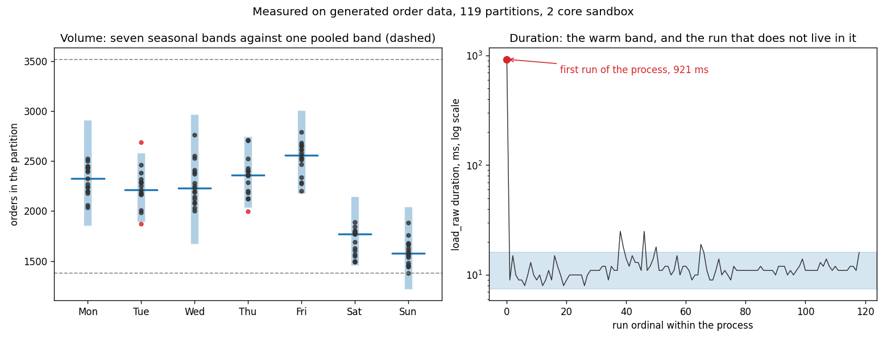

# pipeline-observability

Catch a broken data pipeline before the dashboard consumers do. This repo holds a small
orders pipeline and the run-metadata schema that watches it. Freshness, volume, schema and
distribution monitors get built on top of that metadata over the next six days.

```
pip install -r requirements.txt
python -m pipeline.generate --start 2026-03-02 --end 2026-06-28 --out data/raw
python scripts/run_observed.py --start 2026-03-02 --end 2026-06-28
python -m tests.run_all
```

`pipeline.run` runs the same pipeline with nothing watching it. Keeping both is what makes
the cost of the collector measurable.

## Where the pieces sit

```
  data/raw/dt=YYYY-MM-DD/orders.jsonl        generated source events
        |
        |  pipeline.orders.load_raw          declared columns, partition overwrite
        v
  raw_orders  ----------------------------->  obs_dataset_metric   (done)
        |            obs.collect              obs_column_metric    (done)
        |  pipeline.orders.build_daily        obs_schema_version   (done)
        v            obs.tracker              obs_run              (done)
  daily_orders                                       |
                                                     v
                                       obs.history  ->  obs.baseline   (done)
                                                     |
                                                     v
                                          drift, alerts, timeline
                                                (days 4 to 6)
```

The observability side is `obs/`. The thing being observed is `pipeline/`. They do not
import each other and that separation is the point. `scripts/run_observed.py` is the only
file that knows about both. The collector reaches into the pipeline's warehouse from the
outside, the same way it would have to if the pipeline were a dbt project or someone
else's job.

## The metadata schema

Four tables in `obs/schema.py`. The grain of each is the decision that matters, and each
one is enforced by a key rather than by a comment.

| table | grain | holds |
|---|---|---|
| `obs_run` | one row per pipeline, task, partition and attempt | timing, status, error, what triggered it |
| `obs_schema_version` | one row per distinct column list a dataset has had | the ordered columns and when the shape was first seen |
| `obs_dataset_metric` | one row per run and dataset | row count, byte size, event time range, schema hash |
| `obs_column_metric` | one row per run, dataset and column | nulls, distinct count, min, max, mean, quantiles, top values |

Three choices in there are worth arguing with.

**Schema is stored once per shape and referenced by hash.** The obvious alternative is a
snapshot row per run. That copies an unchanging column list thousands of times to answer a
question asked once per incident. Hashing makes "did the schema change between these two
runs" a string comparison. The hash is order sensitive on purpose. A column reorder breaks
a positional load and is a real incident, not noise.

**Column summaries are quantiles at fixed probabilities, not histograms.** Histogram bins
need edges chosen up front and edges chosen in week one are wrong by week five. Fixed
probabilities compare across any two days with no shared setup. The cost is that seven
quantiles cannot reconstruct a distribution, so a bimodal shift that leaves the quantiles
in place is invisible to this schema.

**`min_value` and `max_value` are text.** One table holds columns of every type, and
splitting into numeric, text and timestamp variants triples the width to serve a field a
human reads during an incident. The numeric summary a monitor reads is `mean_value` plus
`quantiles_json`. The cost is that you cannot write a SQL predicate over `min_value`
without a cast.

## The pipeline being watched

A two stage orders ELT. JSONL partitions land in `raw_orders`, then `daily_orders` is
built from them. Both stages overwrite their partition instead of appending, because a
retry is routine and an append-only load turns one retry into a doubled day. A doubled day
is also the exact shape a volume monitor is meant to catch, so an append here would let
the pipeline manufacture its own alerts.

Load columns are declared, not inferred. `read_json` will guess, and its guess changes
when the data changes, so a null-heavy day can silently retype a column. In a project
about detecting schema drift the loader has to be the one place that does not drift on its
own.

## The collector

`obs/tracker.py` records that a run happened. `obs/collect.py` profiles what it produced.
Four decisions in there are worth arguing with.

**The run row is written before the work, not after.** Timing a run and inserting when it
finishes records every run except the ones worth knowing about. A killed process never
reaches the insert, so the metadata says the run never happened, and a freshness check
then reads a run that died exactly like a pipeline nobody scheduled. Writing at the start
with status `running` costs a second write per run. What it buys is a row saying a run
began and never came back, which `tracker.stale_runs` can find.

**Collection is timed outside the run it belongs to.** Profiling inside the tracked block
would charge the run for the cost of watching it. Median recorded duration here is 10 ms
for `load_raw` and 7 ms for `build_daily` against roughly 38 ms to collect a dataset, so
the duration baseline would have been learning mostly the price of observability.

**Every column summary comes from one SELECT, and not for the reason I expected.** The
plan was that one scan would beat one query per column. It does not. On 254,346 rows the
single pass takes 79.4 ms and the eleven column loop takes 76.9 ms, because DuckDB is
columnar and a query reading one column never touched the other ten. The single pass stays
for two other reasons. It is one consistent snapshot rather than eleven, so a row count
and a null count cannot come from different states of a live table. And it is one round
trip instead of twelve, which is free locally and is the whole cost against a warehouse
across a network.

**Distinct counts are exact.** `approx_count_distinct` is 1.14x faster and its error is
nothing like a small wobble. See the table below. A monitor that cannot see a fourth
`status` value appear is not worth 1.14x.

**Quantiles are exact too, and that one was close.** They are the most expensive thing
the collector does, 31.4 ms of the 79.4, and `approx_quantile` was 2.57x faster at a
worst error of 0.27 percent when it was measured on the day-2 run. The reason it is
still not used is that a t-digest depends on the order rows arrive in. Reading the same
254,346 rows in a different physical order moved p05 by 0.35 percent with nothing about
the data changed. Day 4 is a drift check, and starting it with a noise floor that comes
from the estimator rather than the data is a bad trade for 19 ms on a job that runs once
a day. At a thousand times this volume the answer flips.

## Measured on this machine

Sandbox is 2 cores and about 3.9 GB of RAM. Python 3.10, DuckDB 1.5.5. Everything in
this section was re-measured on the day-3 run, so the timings differ a little from the ones
an earlier version of this file carried. The only figures below not taken that day are the
two `approx_quantile` ones, which are marked where they appear.

```
generate   254,346 events across 119 partitions               2.7 s
pipeline   the same range with nothing watching it            2.5 s   median of 3
observed   the same range with the collector wrapped round   11.6 s   median of 3
collected  238 runs, 2 schema versions, 238 dataset metrics, 2261 column metrics
tests      7 modules, 165 cases, all passing
smoke      27,629 rows over 14 partitions, unchanged after a full rerun
           14 days build no weekday band and one pooled band of 1400 to 3094
```

Collection costs 9.1 s across 238 datasets, about 38 ms each. That is 3.6x the pipeline it
watches. The ratio is a property of how little each run does here rather than a fact about
collectors. A partition is around 2,100 rows, and profiling it is eleven aggregates over
that data plus a group by for each categorical column.

Profiling the full `raw_orders` table, median of three after a warm up query:

| approach | queries | time |
|---|---|---|
| single pass | 1 | 79.4 ms |
| one query per column, same aggregates | 12 | 76.9 ms |
| single pass, quantiles removed | 1 | 48.0 ms |
| single pass, approximate distinct counts | 1 | 69.8 ms |

Quantiles on two numeric columns are 31.4 ms of the 79.4. They are the most expensive
thing the collector does by a wide margin.

`approx_count_distinct` against exact counts on the same table:

| column | exact | approximate | error |
|---|---|---|---|
| `order_id` | 254,346 | 299,919 | 17.92% |
| `customer_id` | 84,649 | 66,950 | 20.91% |
| `ordered_at` | 249,817 | 240,131 | 3.88% |
| `order_amount_usd` | 18,096 | 16,220 | 10.37% |
| `loaded_at` | 119 | 138 | 15.97% |
| `dt` | 119 | 166 | 39.50% |
| `status` | 4 | 3 | 25.00% |
| `item_count` | 9 | 10 | 11.11% |
| `channel`, `country`, `coupon_code` | 4 to 6 | exact | 0% |

Those errors are far larger than the accuracy usually quoted for HyperLogLog. They are
reported as measured. I have not worked out why DuckDB's estimator is this far off on a
column with 119 values and I am not going to guess at a mechanism in a README.

The `status` row is the one that settled it. A column with four values reported as three
is not a tolerance a threshold can absorb, it is the appearance of a new category being
made invisible.

**The slowest run in the entire history is the first one.** Over 119 partitions `load_raw`
has a median of 10 ms and a maximum of 734 ms, and the 734 is the first partition. The
next slowest is 15 ms. Nothing about that date is unusual. The cost is opening the
database and loading the JSON reader, and it lands on whichever run happens to go first.
Any duration baseline built on day 3 has to deal with that or it will page someone every
time the process restarts.

Daily order volume over those 119 days, straight out of `daily_orders`:

| day | days observed | mean orders | sd |
|---|---|---|---|
| Monday | 17 | 2313 | 149 |
| Tuesday | 17 | 2229 | 187 |
| Wednesday | 17 | 2271 | 206 |
| Thursday | 17 | 2348 | 191 |
| Friday | 17 | 2526 | 164 |
| Saturday | 17 | 1691 | 134 |
| Sunday | 17 | 1582 | 126 |

Day of week accounts for 80.4 percent of the variance in daily volume, or 79.3 percent
adjusted for the six degrees of freedom the seven group means cost. Pooled standard
deviation is 367 orders and the residual after removing day of week is 163.

That gap is the argument for the seasonal baseline. A single static band has to be wide
enough to hold both a normal Sunday and a normal Friday. On this data that band spans 1094
to 3014 orders, a width of 1920. The per day-of-week band at the same three sigma is 977
wide. So a Friday has to lose 57 percent of its orders to break the static band and 19
percent to break the seasonal one.

**Read those numbers with the caveat below.** They are measured, and what they are
measured on is synthetic.

## The baseline

`obs/baseline.py` bands a series and `obs/history.py` pulls the observations out of the
metadata. Nothing in `baseline.py` imports duckdb. It takes lists of pairs, which is why
every case below can be tested without a database.

A band is a centre and a spread, widened by k, in either raw or log space, using either
mean with standard deviation or median with a scaled MAD. All four combinations come out
of the same `fit_bands` call. Building the losing side by hand is how a comparison gets
rigged, which happened in this repo two days ago, so there is one code path and the
configuration is an argument.

Run `python scripts/baseline_report.py --obs-db warehouse/obs.duckdb` to reproduce
everything below.



### The seasonal key is a property of the series, not of the project

The blueprint line for today read "seasonal baseline model for volume and duration". That
turned out to be two different answers. `choose_keying` measures it rather than assuming
it, by comparing the mean width of the seven keyed bands against one pooled band over the
same observations.

| series | keyed width | pooled width | ratio | variance explained | adjusted | flat keys | ships |
|---|---|---|---|---|---|---|---|
| volume, `raw_orders` | 868.2 | 2137.9 | 0.406 | 80.4% | 79.3% | 0 | keyed |
| duration, `load_raw` | 9.1 | 8.7 | 1.044 | 5.1% | 0.0% | 0 | pooled |
| duration, `build_daily` | 9.8 | 8.8 | 1.106 | 4.6% | -0.5% | 4 | pooled |

Volume is strongly weekly and the keyed bands are 59 percent narrower. Duration is not
weekly at all. Splitting it seven ways produces bands that are *wider* than the pooled one,
because 17 observations per group estimate a spread worse than 119 do and there is no real
between group difference to recover. The adjusted figure for `build_daily` is negative,
which is what it looks like when seven group means explain less than the degrees of
freedom they cost.

There is a floor under this that matters more than the statistics. `duration_ms` is an
integer. `load_raw` has a median of 11 ms, so one unit of resolution is 9.1 percent of a
typical value. The weekday medians are 10, 11, 11, 11, 11, 11 and 12, so the largest gap
between any two of them is two units. A weekly effect that small is not a small effect,
it is an effect nothing here could have seen. The honest claim is not that duration has
no weekly pattern. It is that none is detectable at this resolution, and a monitor
should not model what it cannot measure.

So volume ships keyed by weekday and duration ships pooled.

### Four of seven `build_daily` bands had no width at all

`build_daily` runs in 6 to 12 ms and most runs land on the same integer. On four weekdays
more than half the observations were the same value, the MAD came out as exactly 0, and
the band collapsed to a point. A band of zero width is not a conservative band. It is a
monitor that fires on everything.

Those bands are marked `degenerate` and `check` returns `unbanded` rather than `high`. A
key with no band returns `unknown_key`. Both are separate answers from `ok`, because
collapsing "I cannot judge this" into "this is fine" is how a dashboard ends up green over
nothing.

The MAD collapses this way whenever more than half the values sit on one number. That is
the cost of a 50 percent breakdown point and it is not a bug. It is the reason
`choose_keying` treats any collapsed key as a reason to pool.

### The median is the default, and the reason is a number

One day doubled inside the training history, which is what a duplicated load looks like:

| space | estimator | clean high edge | contaminated high edge | moved |
|---|---|---|---|---|
| log | median + MAD | 2911.6 | 3037.5 | 4.3% |
| log | mean + sd | 2809.3 | 4076.9 | 45.1% |
| raw | median + MAD | 2856.7 | 2979.1 | 4.3% |
| raw | mean + sd | 2760.8 | 4120.9 | 49.3% |

The point is not that the doubled day should be caught. All four catch it. The point is
what happens to the *next* one. A mean band that widened by 45 percent absorbing the first
duplicate has moved its edge to 4077 orders, and a second duplicated Monday at 4534 is now
much closer to normal than it was. The median band did not move.

The same effect shows up in the duration bands without any help. Fitted over all 119
`load_raw` runs including the cold start, the mean band is 202.6 ms wide in raw space and
64.5 ms in log space. The median band is 8.9 ms. One observation out of 119 is doing all of
that.

And the mean band fires on 0 of 119 training observations for volume. A monitor that never
fires on its own history is not a safe monitor, it is an uninformative one.

### The first run of the process, and why it cannot be absorbed

`load_raw` over 119 partitions has a median of 11 ms. The first run takes 921 ms. Fitting a
warm band on the other 118 gives 7.5 to 16.2 ms, and the first run sits 34.3 spreads above
the centre.

Widening the band to hold it needs k of 34.3, which puts the high edge at 921 ms, or 84x
the median. Buying silence on the restart costs every regression smaller than 84x. That is
not a trade worth making, so the shipped band stays at three sigma and the first run of a
process fires.

Firing is the correct behaviour and it is still an alert nobody wants every morning. The
fix is not in the baseline. It is a label saying this run was cold, which the collector
does not write today, and suppression on it belongs next to the rest of the alert routing
on day 5.

**`build_daily` does not have this problem and that is the part worth noticing.** Its first
run is 6 ms, which is the fastest of all 119 and sits 0.8 spreads *below* the centre. So
the cold start is not a property of the first run of a process. It is a property of the
first run of a task that has to load something, and `load_raw` opens the database and the
JSON reader while `build_daily` is SQL over structures that are already warm. A rule that
excluded every first observation would have thrown away a perfectly good one here.

`build_daily` has a different outlier instead. Its slowest run is 122 ms at ordinal 105 out
of 119, against a next slowest of 26 ms and a median of 7 ms, and nothing distinguishes
that date. It is the machine, not the data.

### A third of the band is trend, not noise

The generator has 0.15 percent daily growth in it, which compounds to about 19 percent over
119 days, and the observed series moves 14.2 percent from its first 28 partitions to its
last 28. A band fitted over the whole history holds all of that as if it were spread.

Each row below fits on a trailing window and then judges the same most recent 28
partitions, so the last column is comparable across rows in a way a fire rate on each
window's own training data is not.

| window | per weekday | bands | mean width | fires on own history | fires on last 28 |
|---|---|---|---|---|---|
| all 119 | 17 | 7 | 868.2 | 0.025 | 0.036 |
| 84 | 12 | 7 | 594.9 | 0.083 | 0.107 |
| 56 | 8 | 7 | 564.2 | 0.143 | 0.179 |
| 42 | 6 | 0 | too few observations per key | | |
| 28 | 4 | 0 | too few observations per key | | |

The full history band is 35 percent wider than a 56 day one, and the difference is drift
rather than variability. But the shorter window fires on 18 percent of recent partitions
against 3.6 percent, because eight observations per weekday estimate a spread badly. A
weekday key charges seven observations for every one it uses, and at 42 days there is not
enough left to build a band at all.

The full window ships, because it is the conservative end and because choosing a shorter
one by which fire rate reads best is the same mistake as tuning a threshold to the data it
will be judged on. The real answer is a trend term, which would let a short window keep its
observations, and that is not a thing to bolt on at the end of a day. It goes next to day
4, where the same question turns up again for column distributions.

### Seventeen observations per weekday is not many

Refitting each weekday band with one observation held out, seventeen times:

| key | low edge range | high edge range |
|---|---|---|
| Monday | 1797 to 1935 | 2861 to 2952 |
| Tuesday | 1844 to 1965 | 2534 to 2625 |
| Wednesday | 1644 to 1713 | 2895 to 3022 |
| Thursday | 1889 to 2069 | 2697 to 2955 |
| Friday | 2137 to 2245 | 2944 to 3036 |
| Saturday | 1305 to 1460 | 2146 to 2297 |
| Sunday | 1200 to 1247 | 2003 to 2058 |

Thursday's low edge moves 180 orders depending on which single day is dropped. That is not
a confidence interval and it is not presented as one. It is the honest version of the
question, which is how much of this band is the data and how much is which seventeen days
happened to be in it.

### What ships

Volume, keyed by weekday, log space, median and MAD, three sigma:

| key | n | low | centre | high | width |
|---|---|---|---|---|---|
| Monday | 17 | 1853 | 2323 | 2912 | 1058 |
| Tuesday | 17 | 1895 | 2211 | 2580 | 685 |
| Wednesday | 17 | 1673 | 2228 | 2967 | 1294 |
| Thursday | 17 | 2034 | 2362 | 2743 | 708 |
| Friday | 17 | 2180 | 2559 | 3004 | 825 |
| Saturday | 17 | 1458 | 1768 | 2144 | 686 |
| Sunday | 17 | 1221 | 1579 | 2042 | 821 |

It fires on 3 of its own 119 training observations, a rate of 0.025. Pooled duration bands
are 7.5 to 16.2 ms for `load_raw` firing on 6 of 119, and 3.9 to 12.7 ms for `build_daily`
firing on 2 of 119. Those rates are measured on the training data, so they are a floor on
the false alarm rate rather than an estimate of the real one.

## Known limitations

**The source data is generated, and its weekly shape is assumed rather than observed.**
The day of week factors in `pipeline/generate.py` are a plausible retail pattern that I
chose. So the 80.4 percent figure above is a true statement about this feed and not
evidence about real traffic. Anyone reading it as the latter is reading it wrong.

**That creates a circularity risk for the volume baseline and it is not solved.** If the
generator lays down a clean weekly pattern and the baseline learns that pattern, nothing
has been shown. The 80.4 percent and the 0.406 width ratio are both true statements about
this feed and neither is evidence that the design works. Two things push back. The
generator is multiplicative and the raw space band is additive, so those two configurations
are not the same model and the report runs both. More importantly the test of this baseline
is not fit quality. It is whether it stays quiet through the nuisances that go in on day 6
as injected failures. Judge it there.

**The findings about the estimators do not depend on the generated data, and the findings
about the seasonal key do.** That one day doubled in the history moves a mean band 45
percent and a median band 4.3 percent is arithmetic. That volume is weekly and duration is
not is a fact about a feed I wrote.

**The band has no trend term, so it is fitted on a series that is drifting.** Measured
above at 35 percent of the width on this data. The two ways out both cost something and
neither was taken today.

**Log space is the default and on this data it is not doing much.** The argument for it is
that the generator is multiplicative, so an additive band on raw counts is the wrong shape.
The measurement says the volume bands come out 868.2 wide in log space and 869.2 in raw, a
difference of 0.1 percent, because the spread here is small relative to the level and over
a small range the two are nearly the same. So the default is defended by the form of the
data and not by the numbers. It would start to matter on a series with a much larger
relative spread, and it already matters for duration, where the mean and standard deviation
band is 202.6 ms wide in raw space and 64.5 ms in log.

**k is 3 and it is not tuned.** It is the conventional starting point. The report measures
what it costs at 3, which is a fire rate of 0.025 on the training history for volume, and
nothing has calibrated it against a real cost of a false alarm because there is no real
consumer yet.

**Every fire rate quoted here is measured on the training data.** A band evaluated against
the observations it was fitted on is at its most flattering, so those rates are a floor and
not an estimate. There is no held out period and there will not be a meaningful one until
day 6 puts known failures in.

**A cold start cannot be labelled from the metadata as it stands.** The 921 ms first run is
correctly flagged and there is no column that says why. Suppressing it needs the collector
to record that the process was cold, and inferring it from a gap in `started_at` would not
survive contact with a real daily schedule, where every run is 24 hours after the last one
and every run is cold. The label belongs in the collector and the suppression belongs in
day 5.

**A log space band cannot hold a zero.** A task fast enough to record 0 ms raises instead
of being clamped, because a floor invented to keep the fit alive is a number nobody chose
appearing in an alert threshold. `build_daily` is already at 6 ms. If it gets faster, the
answer is to record microseconds.

**The MAD collapses when more than half the values are the same.** This is the flip side of
its 50 percent breakdown point rather than a defect, and on integer millisecond durations it
happens often. Four of seven `build_daily` weekday bands came out with zero width. They are
marked and refuse to judge, which is safe, and it does mean a robust estimator on
low resolution data can produce no baseline at all rather than a bad one.

**`daily_orders` groups on the partition date, not on `ordered_at`.** An event that
happened on the 3rd and landed in the 4th's file is counted on the 4th. The generator
never does that, so the pipeline is correct here only because its source is well behaved.
That is the single most likely place a real feed would break this, and late arrival is on
the day-6 list of injected failures.

**A collector failure leaves a gap, and a gap is ambiguous.** `collect_into` catches
everything, because the pipeline should not fall over when the thing watching it does.
What is left behind is a successful run with no dataset metric row. Day 5 can alert on
that. What it cannot do is tell a broken collector apart from a dataset nobody pointed the
collector at, and both look like silence.

**`next_attempt` scans `obs_run` on every run start.** There is no index, so the cost
grows with the history rather than staying flat. At 238 rows it is invisible. At ten
million it is a full scan every time a task starts, which is the kind of thing that looks
free for a year and then does not.

**Attempt numbers are read then written, which is not atomic.** Under DuckDB in one
process this is fine, and the unique key would reject a real collision anyway. Under
Snowflake it is not fine, because Snowflake accepts a unique constraint and enforces
nothing, so two schedulers starting the same partition would both write the same attempt
number and neither would be told.

**Top values are only collected below 50 distinct values, and that cutoff is a guess.**
The categorical columns here sit at 4 to 6 values, so 50 is far enough above them to be
safe rather than tuned. A real feed with a 200 value category would get no top values at
all and nothing would say so.

**A quantile summary cannot see a shift that preserves the quantiles.** This is the day-1
schema tradeoff arriving in the collector. Seven probabilities do not reconstruct a
distribution, so a bimodal split that leaves the deciles where they were is invisible.
Day 4 has to say plainly what its drift check can and cannot detect.

**The Snowflake DDL has never been run.** It is generated from the same template as the
DuckDB DDL so the two cannot drift apart, and it is unverified. It also carries a real
behaviour difference. Snowflake accepts `PRIMARY KEY` and `FOREIGN KEY` and enforces
neither, so the grain guarantees that hold here are documentation there. The collector has
to treat a duplicate grain as its own problem rather than expect the warehouse to reject
it.

**No Airflow yet.** The blueprint lists it and `pipeline/run.py` is a plain loop today.
The DAG comes when there is more than one task worth scheduling.

## Week plan

- Day 1: metadata schema, repo, target pipeline to instrument (done)
- Day 2: collector and storage (done)
- Day 3: seasonal baselines for volume and duration (done, and duration is not seasonal)
- Day 4: distribution drift checks
- Day 5: alerting, severity, suppression windows
- Day 6: incident timeline and injected failures
- Day 7: README with three worked incident examples

## Tests

`python -m tests.run_all` is the only entrypoint and CI calls nothing else. A module that
reports zero cases fails the run, because the usual way a suite lies is not a wrong
assertion. It is a file the runner imported and never executed.

`scripts/smoke.py` covers the command line path. It generates two weeks, runs the range,
snapshots the counts, runs the same range again and compares. Then it runs the observed
path and holds the metadata to the warehouse. The row counts in `obs_dataset_metric` have
to add up to the rows actually in `raw_orders`. Every collector unit test points it at a
table built inside the test, so this is the only place its numbers meet a pipeline that
really ran.

Every check here was falsified before it was kept. Reverting the fix and confirming the
test goes red is the only way to know a test tests anything.

| mutation | result |
|---|---|
| `load_raw` appends instead of overwriting the partition | 8/11, doubles to 4076 rows |
| `schema_hash` joins name and type pairs with a newline | 14/15, two schemas collide |
| drop the composite key on `obs_column_metric` | 14/15, duplicate grain accepted |
| a test module that asserts nothing | run_all fails it at 0 cases |
| the same appending load, against the smoke check | exit 1, 27,629 rows become 55,258 |
| drop the transaction around the delete and the insert | 11/12, a bad file empties the partition |
| the profile query drops its `WHERE` clause | crashes on a parameter mismatch |
| the result row is sliced one position out | crashes converting a date to a float |
| `null_count` reports the non nulls instead | 31/32 |
| identifiers are not quoted | crashes on a column named `select` |
| `collect_into` raises instead of recording a gap | the failure escapes to the caller |
| top values ignore the partition filter | 30/32 |
| the run row is written after the work instead of before | the running row is not there to find |
| the tracker swallows the failure | 15/18 |
| `next_attempt` always returns 1 | the retry overwrites the first attempt |
| `stale_runs` ignores its cutoff | 17/18 |
| the collector profiles the table instead of the partition | smoke: 211,675 recorded against 27,629 loaded |
| the run is never closed out | smoke: 0 successful runs for 14 days of two tasks |
| `median_mad` returns the mean and standard deviation | 53/58 |
| a zero spread band is not marked degenerate | crashes dividing by zero |
| an unknown key is answered `ok` | 57/58 |
| log space clamps a zero instead of raising | 56/58 |
| the last successful attempt becomes the first | 54/58 |
| the defensive sort goes and the rows arrive in reverse attempt order | 54/58 |
| the duration history keeps failed runs | 57/58 |
| an unreadable partition key is dropped without being counted | 56/58 |
| the adjusted variance does not charge for the groups | 57/58 |
| `choose_keying` ignores a key whose spread collapsed | 56/58 |
| `fit_bands` ignores its minimum observation count | 57/58 |
| the log band is built and read in raw space | 56/58 |
| the volume history keeps every attempt | 52/58 |
| the minimum observation count drops to 2, against the smoke check | exit 1, seven weekday bands from a fortnight |

Five of the first twelve baseline mutants survived and three of those five shared a
cause. The history fixture had one successful attempt per partition, so
the rule about which attempt counts, the rule about excluding failures, and the rule about
not double counting a retry were all passing without ever being exercised. The fixture now
has a partition that failed then succeeded twice, one that only ever failed, and one that
succeeded and then failed on a later attempt.

The fourth survivor is the more embarrassing one. The test asserted that log space raises
`ValueError` on a zero, and `math.log` raises `ValueError` on a zero all by itself, so
deleting the guard changed nothing. It now checks the message.

Six of those kill the suite by crashing it rather than by failing an assertion. A crash is
still a kill and it is a weaker one, because it means the test would not have said which
thing broke.

The null count mutation is the reason this table is worth building. It passed on the first
attempt. The fixture had four rows with two nulls in the column being checked, so counting
the nulls and counting the non nulls gave the same answer. The fixture now has a column
that is null in three rows out of four.
